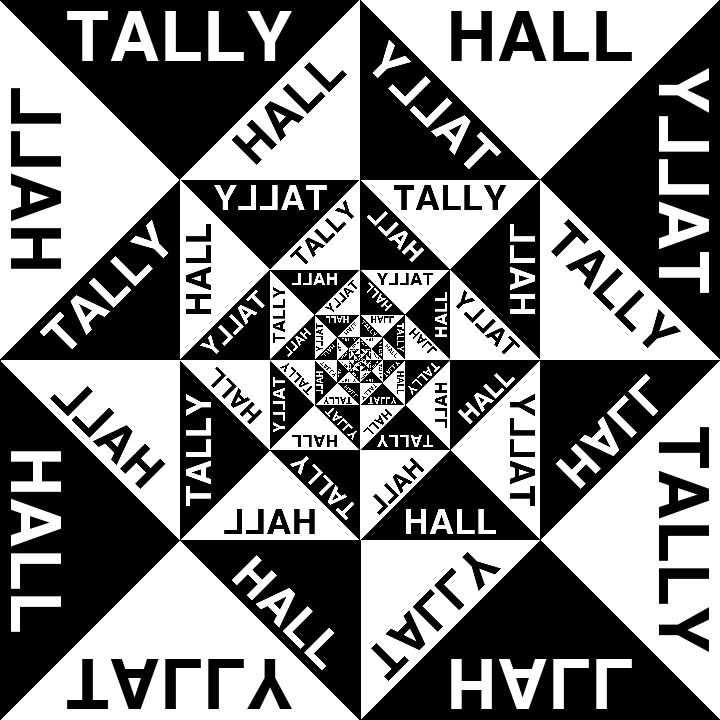
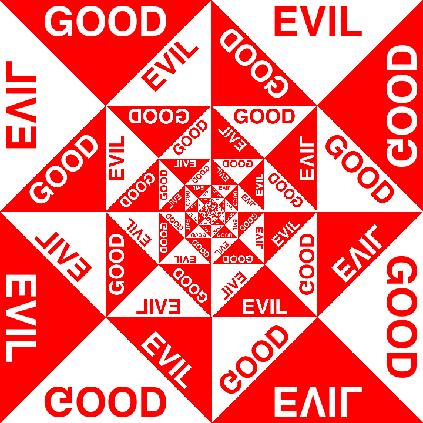
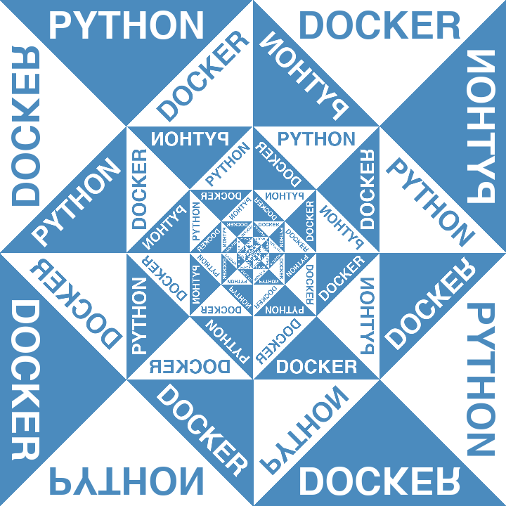

# good_and_evil_server

Python Django webapp for generating images in the style of Tally Halls's "Good & Evil" album cover!

Usage is `/<hex_color>,<str1>,<str2>,<font_size>` with font_size being optional (default 70). Examples:

| `/000000,TALLY,HALL`            | `/ff0000,GOOD,EVIL`            | `/4B8BBE,PYTHON,DOCKER,54`            |
| ------------------------------- | ------------------------------ | ------------------------------------- |
|  |  |  |

Core artwork generation code is in [process.py](good_and_evil_app/process.py).

Running live instance might be available [here](http://167.172.140.13/create).

The usual `sudo docker-compose up` is enough to run it.
